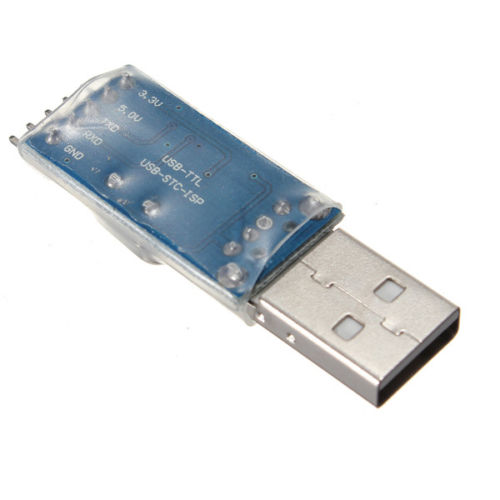

# Firmware Programming & Update

## Initial Programming

The first installation of this firmware onto Gotek can be done either
by [serial](#serial-programming) or [USB](#usb-programming) link to
a host PC.

### Serial Programming

This method requires a USB-TTL serial adapter, which are readily
available on Ebay or from project webstores:
- [CAB-12977 from SparkFun](https://www.sparkfun.com/products/12977)
- Search "PL2303HX usb ttl adapter" on Ebay, available for around one dollar.



The Gotek is then jumpered in system-bootloader mode and programmed
from the host PC. See the below picture for wiring and jumper
selection. This Gotek has had pins soldered to the programming
header. It is possible to make the required connections with no
soldering, but be careful that all wires are sufficiently well
connected. Also note that the ordering of the connections
(5V,GND,TX,RX) can vary across adapters, so be careful to note the
ordering on your own.


The programming process is described, along with suitable
Windows software, on the
[Cortex firmware webpage](https://cortexamigafloppydrive.wordpress.com).
Of course, rather than using the Cortex HEX file, use the HEX file
contained in the FlashFloppy release archive.

If programming on Linux, you can follow the Cortex instructions to
physically set up your serial connection and bootstrap the Gotek, and
then use stm32flash to do the programming:

```
 # sudo stm32flash -w flashfloppy_fw/FF_Gotek*.hex /dev/ttyUSB0
```

### USB Programming

See this [Youtube video](https://www.youtube.com/watch?v=yUOyZB9cro4@feature=youtu.be)
for detailed instructions on this method. You will require a USB-A to
USB-A cable, and you should program the HEX file contained in the
FlashFloppy release archive.

## Updates

If you have previously flashed the full firmware, you can make future
updates via USB stick.

- Remove all old *.UPD files from the root of the USB stick.
- Copy the *.UPD file from the root of the release archive to the root of
  the USB stick.
- Insert the USB stick into the Gotek and power on with both buttons pressed.
- You should now be in the bootloader ("UPD"). Release both buttons.
- The latest firmware will be programmed and the Gotek will reboot into it.
- Success!

Errors during update are reported on the LED display:
- **E01** No update file found
- **E02** More than one update file found
- **E03** Update file is invalid (bad signature or size)
- **E04** Update file is corrupt (bad CRC)
- **E05** Flash programming error
- **Fxx** FatFS error (probably bad USB drive or filesystem)

## Updating the Bootloader

The main bootloader can also be updated by USB stick. Note that it is
important for this operation to succeed, otherwise the Gotek will require
a full reflash by following the steps in
[Initial Programming](#initial-programming). Therefore make sure the
Gotek has a stable power supply and a known good USB stick.

New features and bugfixes are rare. In general **you do not need to
update the bootloader** and can skip these steps.

**I repeat: do not follow these steps unless you are sure of what you are
doing.**

- Remove all old *.UPD and *.RLD files from the USB stick.
- Copy the contents of the release's reloader/ folder to the root of
  the USB stick.
- Insert the USB stick into the Gotek and power on with both buttons pressed.
- You should now be in the bootloader ("UPD"). Release both buttons.
- The 'reloader' will be programmed and the Gotek will reboot into it.
- You should now be in the reloader ("RLD"). Press and release both buttons.
- The latest bootloader will be programmed. The Gotek will then reboot.
- You are now in the reloader again. Power off.
- Remove the *.UPD and *.RLD files from the USB stick.
- Copy the *.UPD file from the root of the release archive to the USB stick.
- Insert the USB stick into the Gotek and power on with both buttons pressed.
- You should now be in the bootloader ("UPD"). Release both buttons.
- The latest firmware will be programmed and the Gotek will reboot into it.
- Success!
