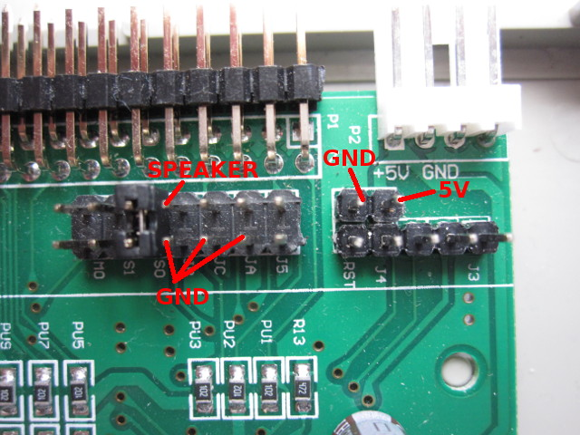
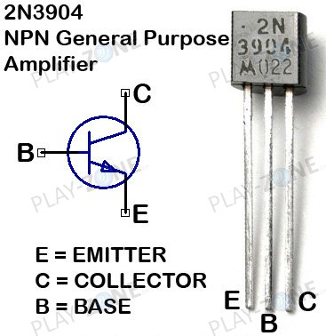
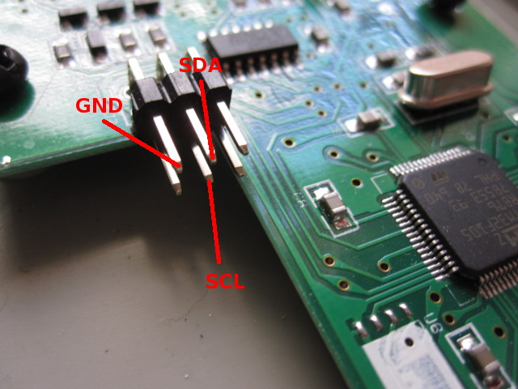
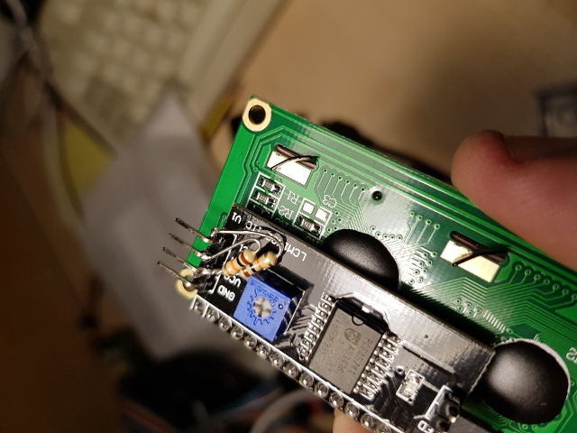
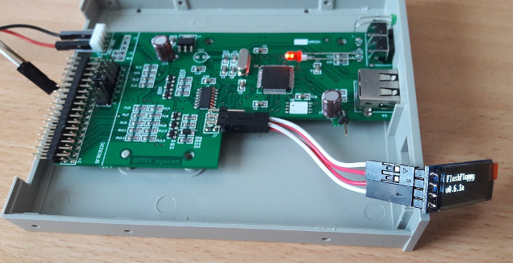
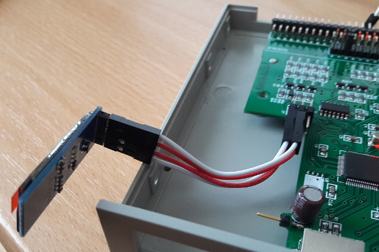
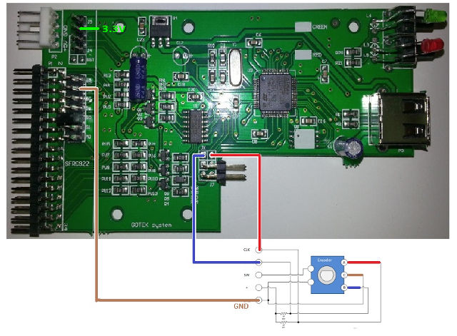

# Hardware Mods

- [Speaker](#speaker)
- [LCD Display](#lcd-display)
- [OLED Display](#oled-display)
- [Rotary Encoder](#rotary-encoder)

## Speaker

A speaker can be attached to the Gotek to sound whenever the floppy
drive heads are stepped. A piezo sounder can be connected directly
between jumper JB and Ground, marked respectively as SPEAKER and GND
in the picture below.

A magnetic speaker should be buffered via an NPN transistor (eg
2N3904) as follows:
- **Base**: connected to JB (SPEAKER) via a 1k resistor
- **Collector**: connected to one terminal of the speaker (the other
    connected to 5v)
- **Emitter**: connected to Ground (GND)

Pinout for the 2N3904 is shown below (note that the leg arrangement
can differ on other NPN transistors).

## LCD Display

As an alternative to the Gotek 7-segment display, FlashFloppy supports
the ubiquitous 1602 LCD with I2C backpack board. These are available
from many Ebay sellers. The connections should be made just as for HxC
Gotek firmware, including pullup resistors (if required - see below).

You can locate SCL, SDA, and GND on your Gotek PCB as below. These
connect to the corresponding header pins on your LCD I2C backpack
module.

VCC (aka 5V) can be found in various places, including just behind the
floppy power connector.

The SCL and SDA lines must be connected to VCC ("pulled up" to VCC)
via 4.7k resistors.  Note that many I2C boards have the pullup
resistors on board and in this case you do not need to attach your own
external pullups. You can confirm this by checking the resistance
between SDA/SCL and VCC. If it is less than 10k you do not need to add
pullups.

If you do require the pullup resistors, these can be soldered to the
backside of the Gotek PCB between VCC and each of SDA and
SCL. Alternatively can be soldered to the back of the I2C module
header as below.

## OLED Display

Another alternative to the Gotek 7-segment display is a 0.91" 128x32
display, as sold for Arduino projects by many Ebay sellers. You will
require a display with I2C interface: you should see it has a 4-pin
header marked GND, VCC, SCL, SDA.

These displays can simply connect to the 7-segment display's header,
reusing the existing jumper wires, as in the pictires below.

## Rotary Encoder

As an alternative to using the up/down buttons, you can instead connect
a KY040 rotary encoder. The picture below shows how to connect it.

Rotating the dial should now have the same effect as pushing the
buttons: anti-clockwise for down, and clockwise for up.

Troubleshooting:
- Directional controls are inverted: swap the CLK and DT (aka A and B) wires.
- Both directions move up (or down):
  - Connect + to 3.3V (marked in picture above); or
  - Remove pull-up resistors from the back of the KY040 PCB; or
  - Remove the encoder from the PCB and solder wires directly.
